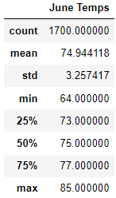
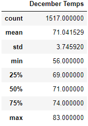

# Waves and Ice Cream: _"A Dream Come True"_

## Overview
### Do something you love for a job, and never work a day in your life!
Picture this is you will: It's August (8/23/2017 to be exact) you are laying on the beach in Oahu Hawaii watching the locals surf majestically upon the beautiful waves. You think _"I can do that"_ and give it a shot signing up for some lessons. You instantly fall in love with the freedom surfing gives you and while you let yourself glide down another perfect wave you say to yourself, _"I want to do this for the rest of my life!"_. The decision is made a surf shop that serves ice cream, and an investor is found William I. Avy. William has already received a plethora of information and has asked for one last piece, weather data from June and December, to understand if the business is sustainable all year long.  

## Results
### June & December Temperature Data:

#### Points to Consider:
  - The max temperature for each month is only different by 2 degrees, both in the 80's and pleasant enough to eat ice cream and surf in.
  - The minimum temperature for each is considerably different, with Decembers getting as low as 56 degrees, possibly to cold surfing.
  - The average temperature is also very close and in the 70's ideal weather for surfing.

## Summary
### Overall Thoughts:
As someone that lives in Minnesota seeing lows of lows of 56 degrees in Hawaii in the month of December is enough motivation to just move there and figure our everything else when I get there... But I do not need to do that, as I have a plan, investor, and basically perfect year round weather to run a Surf Shop/Ice Cream business. Is December perfect, no, but it is good enough and with some carpule budgeting and saving of our higher income during the other months I believe the business will thrive. 

### Additional Queries
  - I would like to develop a query that with specific time of day data (time we plan to have the business running) to get a better view of what the weather is actually like during business hours. 
  - Peak Tourist times of the year, to develop a peak profit model to base our hours of operation on.

